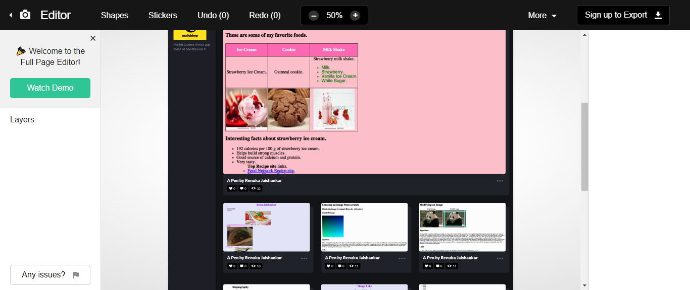

## Portfolio

---

### Category Name 1 

[Recommendation system](/sample_page.md)

---
[HTML,CSS and Javscript project](https://codepen.io/RenuJaishankar)
<!-- [HTML,CSS and Javscript project](/pdf/sample_presentation.pdf) -->

https://codepen.io/RenuJaishankar
---
[Flower Website](http://example.com/)

[Flower Website](https://renujaishankar.github.io/Feb7thhostedRepo/)

---

### Category Name 2

- [Project 1 Title](http://example.com/)
- [Project 2 Title](http://example.com/)
- [Project 3 Title](http://example.com/)
- [Project 4 Title](http://example.com/)
- [Project 5 Title](http://example.com/)

---

---

Page template forked from <a href="https://github.com/evanca/quick-portfolio">evanca</a>

<!-- Remove above link if you don't want to attibute -->
