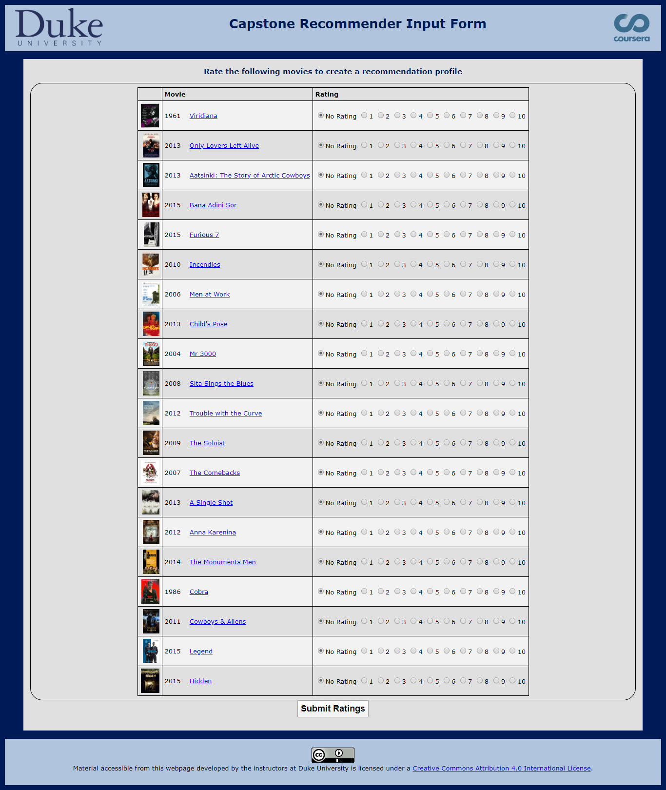

## THE RECOMMENDATION SYSTEM.

**Project description:** •	Completed Duke Certification on Java Programming and Software Engineering Fundamentals. This certification include 5 core courses that covered HTML, CSS, JavaScript and Core Java.

•	As part of this course Completed a Capstone project that included Building a Movie Recommendation Engine (like Netflix has!)

•	Key features of this Recommendation Engine is highlighted below.

o	Accept movie and rating from Tweets, from twitter feed using Movie Tweetings Data set.
o	Used Apache CSV Project to access data.
o	Compute Average Movie rating for each movie.
o	Gathered additional details on the movie from Movie database.
o	Stored additional details on “Hash Map” so it can be accessed faster.
o	Accept rating from the current user and compute how similar a given rater is to another user based on his/her ratings. 

[The recommendation project link.](http://www.dukelearntoprogram.com/capstone/recommender.php?id=sNcezFq6EMAOua)  

For more details see [GitHub Flavored Markdown](https://guides.github.com/features/mastering-markdown/).
